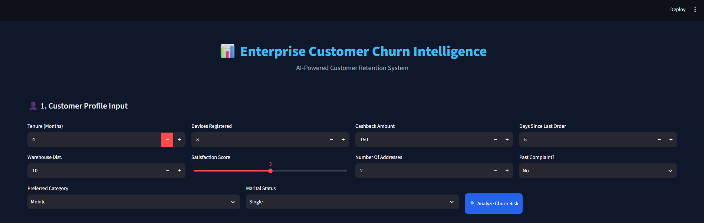
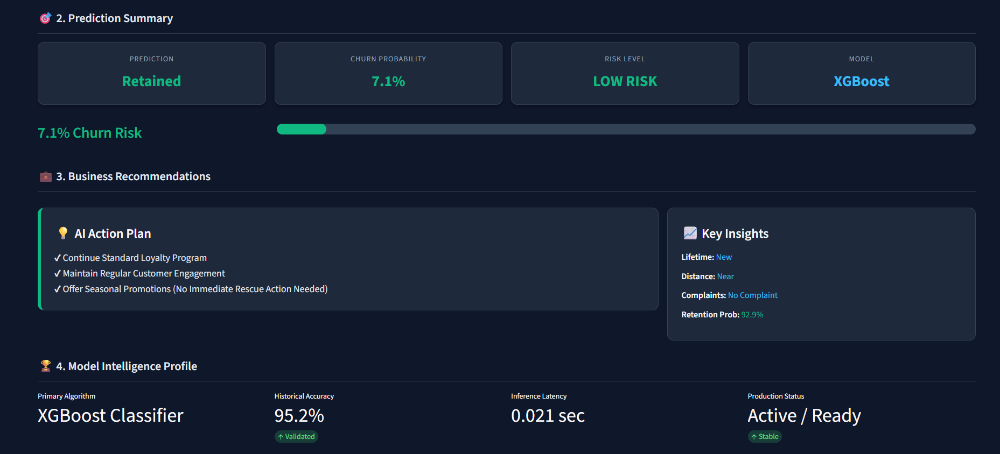

# 📊 Enterprise Customer Churn Intelligence Platform

An end-to-end Machine Learning project that predicts whether an Ecommerce customer is likely to churn. The project combines Data Analysis, Machine Learning, Power BI Dashboarding, and Streamlit deployment to provide business-ready insights and recommendations.

---

# 🚀 Project Overview

Customer churn is one of the biggest challenges for Ecommerce companies.

This project predicts customer churn using an XGBoost Machine Learning model and provides business recommendations to help improve customer retention.

The project covers the complete Data Science lifecycle from data preprocessing to dashboard visualization and deployment.

---

# 🎯 Objectives

- Predict customer churn accurately
- Identify high-risk customers
- Provide actionable business recommendations
- Visualize business insights using Power BI
- Deploy an interactive prediction application using Streamlit

---

# 🛠 Technology Stack

### Programming

- Python 3.13
- SQL
- Git & GitHub

### Libraries

- Pandas
- NumPy
- Matplotlib
- Seaborn
- Scikit-Learn
- XGBoost
- Joblib
- Streamlit

### Visualization

- Power BI

### Development Tools

- VS Code
- Jupyter Notebook

---

# 📂 Project Structure

```
Enterprise-Customer-Churn-Intelligence-Platform/

│
├── app/
│
├── data/
│
├── models/
│     └── churn_prediction_bundle.pkl
│
├── notebooks/
│
├── screenshots/
│     ├── app_home.png
│     ├── prediction_result.png
│     └── powerbi_dashboard.png
│
├── streamlit_app.py
├── requirements.txt
├── README.md
└── LICENSE
```

---

# ⚙ Machine Learning Workflow

### 1. Business Understanding

- Understand customer churn problem
- Define business objective

### 2. Data Collection

- Ecommerce Customer Dataset

### 3. Data Cleaning

- Missing Value Treatment
- Duplicate Removal
- Data Type Correction

### 4. Exploratory Data Analysis (EDA)

- Univariate Analysis
- Bivariate Analysis
- Correlation Analysis
- Churn Distribution
- Complaint Analysis

### 5. Feature Engineering

Created new features:

- CustomerLifetime
- DistanceBucket
- ComplaintLabel

### 6. Data Preprocessing

- One Hot Encoding
- Feature Scaling
- Train-Test Split

### 7. Machine Learning

Models Tested:

- Logistic Regression
- Random Forest
- XGBoost (Final Model)

### 8. Model Evaluation

Metrics Used:

- Accuracy
- Precision
- Recall
- F1 Score
- Confusion Matrix

---

# 🧠 Final Model

Model Used:

**XGBoost Classifier**

Performance:

- Accuracy: **95.2%**
- Precision: Excellent
- Recall: Excellent
- F1 Score: High

---

# 💻 Streamlit Application

Features

- Interactive UI
- Real-time Prediction
- Churn Probability
- Risk Level
- AI Action Plan
- Business Recommendations
- Key Insights
- Model Information

---

# 📈 Power BI Dashboard

Dashboard includes:

- KPI Cards
- Churn Distribution
- Complaint Analysis
- Satisfaction Analysis
- Cashback Analysis
- Warehouse Distance Analysis
- Customer Segmentation
- Interactive Filters
- Executive Business Dashboard

---

# 📸 Project Screenshots

## 🏠 Streamlit Application



Interactive interface for entering customer details and performing churn prediction.

---

## 🤖 Prediction Result



Displays:

- Prediction
- Churn Probability
- Risk Level
- AI Recommendations
- Business Insights
- Model Information

---

## 📊 Power BI Dashboard


Executive dashboard showing:

- Customer Churn KPIs
- Complaint Analysis
- Customer Segmentation
- Satisfaction Trends
- Cashback Analysis
- Business Insights

---

# 📦 Installation

Clone the repository

```bash
git clone https://github.com/ranjanthedatascientist98-cr/Enterprise-Customer-Churn-Intelligence-Platform.git
```

Move into project folder

```bash
cd Enterprise-Customer-Churn-Intelligence-Platform
```

Install dependencies

```bash
pip install -r requirements.txt
```

Run Streamlit

```bash
streamlit run streamlit_app.py
```

---

# 📌 Future Improvements

- FastAPI Deployment
- Docker Containerization
- Cloud Deployment (AWS/Azure)
- User Authentication
- Database Integration
- Customer Management Portal

---

# 📖 Skills Demonstrated

- Python
- SQL
- Data Cleaning
- EDA
- Feature Engineering
- Statistics
- Machine Learning
- XGBoost
- Model Evaluation
- Streamlit
- Power BI
- Git
- GitHub
- Business Intelligence

---

# 👨‍💻 Author

**Chittaranjan Mohapatra**

Aspiring Data Analyst | Data Scientist | Machine Learning Enthusiast

GitHub:

https://github.com/ranjanthedatascientist98-cr

LinkedIn:

(Add your LinkedIn profile here)

---

# ⭐ If you found this project helpful, please consider giving it a Star.